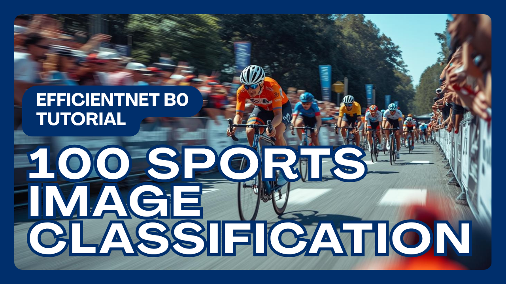

# 100 Sports, One Model — EfficientNetB0 Tutorial

  

##
   

Learn how to build a powerful image classification model that recognizes 100 different sports categories using EfficientNetB0 and Python.
In this step-by-step tutorial, we’ll walk through the entire pipeline — from loading the dataset and visualizing images, to training, evaluating, and predicting new sports images with transfer learning.

 

You can find more blogs and tutorials in my [blog post](https://eranfeit.net/blog/) here.  
You can find the link for the [Tutorial tutorial](https://youtu.be/17UYxFjtMsw) here. 

You can find more image Classification tutorials in this [playlist](https://www.youtube.com/watch?v=n-SpVoHrzDQ&list=PLdkryDe59y4aytIPjci6_fn3B1-QuM-Oh)

Enjoy

Eran
   

# Recommended courses and relevant products 

🚀 Want to get started with Computer Vision or take your skills to the next level ? 

If you’re just beginning, I recommend this step-by-step course designed to introduce you to the foundations of Computer Vision - [Complete Computer Vision Bootcamp With PyTorch & TensorFlow](https://trk.udemy.com/9LoE7E) 

If you’re already experienced and looking for more advanced techniques, check out this deep-dive course - [Modern Computer Vision GPT, PyTorch, Keras, OpenCV4](https://trk.udemy.com/EEDyMD)

Before we continue , I actually recommend this [book](https://amzn.to/3STWZ2N) for deep learning based on Tensorflow and Keras. 

# Connect

If you have any suggestions about papers, feel free to mail me :)

- [☕ Buy me a coffee](https://ko-fi.com/eranfeit)
- [🌐 My Website](https://eranfeit.net)
- [▶️ Youtube.com/@eranfeit](https://www.youtube.com/channel/UCTiWJJhaH6BviSWKLJUM9sg)
- [🐙 Facebookl](https://www.facebook.com/groups/3080601358933585)
- [🖥️ Email](mailto:feitgemel@gmail.com)
- [🐦 Twitter](https://twitter.com/eran_feit )
- [😸 GitHub](https://github.com/feitgemel)
- [📸 Instagram](https://www.instagram.com/eran_feit/)
- [🤝 Fiverr ](https://www.fiverr.com/s/mB3Pbb)
- [📝 Medium ](https://medium.com/@feitgemel)

