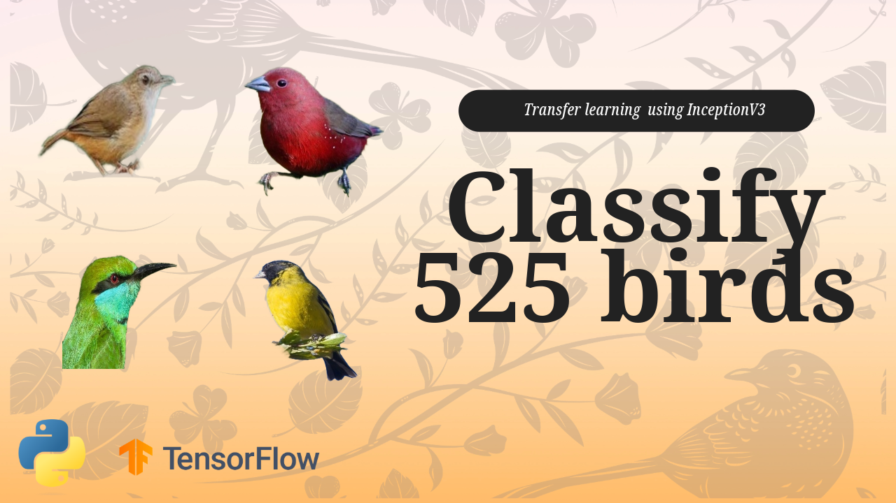

# Inception-V3 For Birds Images Classification Using Transfer Learning

  

##
   

Welcome to our tutorial on transfer learning using InceptionV3 with TensorFlow! 
We will classify more than 500 birds classes 
In this video, we'll guide you through the entire process of preparing your data, building the model, and testing its performance.

 
🔍 Data Preparation: We'll start by preparing the train , test and validation images folders.

🛠️ Model Building with TensorFlow Keras: Next, we'll dive into the implementation of InceptionV3 architecture using TensorFlow's Keras API. You'll learn how to configure and fine-tune the pre-trained model for your specific task.

📊 Testing the Model: Once the model is trained, we'll show you how to test the model using a new and fresh image 

 

You can find the link for the [tutorial](https://eranfeit.net/how-to-classify-525-bird-species-using-inception-v3-and-tensorflow/) here.  
You can find the link for the [Video tutorial](https://youtu.be/d_JB9GA2U_c) here. 

You can find more cool similar projects and tutorials in this [playlist](https://www.youtube.com/playlist?list=PLdkryDe59y4aCcCN4ioFpdLVAGZ_dFeFr)

Enjoy

Eran
   

# Recommended courses and relevant products 

A perfect course for learning modern Computer Vision with deep dive in TensorFlow , Keras and Pytorch . You can find it [here](http://bit.ly/3HeDy1V).

Perfect course for every computer vision enthusiastic

Before we continue , I actually recommend this [book](https://amzn.to/3STWZ2N) for deep learning based on Tensorflow and Keras. 

# Connect

If you have any suggestions about papers, feel free to mail me :)

- [☕ Buy me a coffee](https://ko-fi.com/eranfeit)
- [🌐 My Website](https://eranfeit.net)
- [▶️ Youtube.com/@eranfeit](https://www.youtube.com/channel/UCTiWJJhaH6BviSWKLJUM9sg)
- [🐙 Facebookl](https://www.facebook.com/groups/3080601358933585)
- [🖥️ Email](mailto:feitgemel@gmail.com)
- [🐦 Twitter](https://twitter.com/eran_feit )
- [😸 GitHub](https://github.com/feitgemel)
- [📸 Instagram](https://www.instagram.com/eran_feit/)
- [🤝 Fiverr ](https://www.fiverr.com/s/mB3Pbb)
- [📝 Medium ](https://medium.com/@feitgemel)

