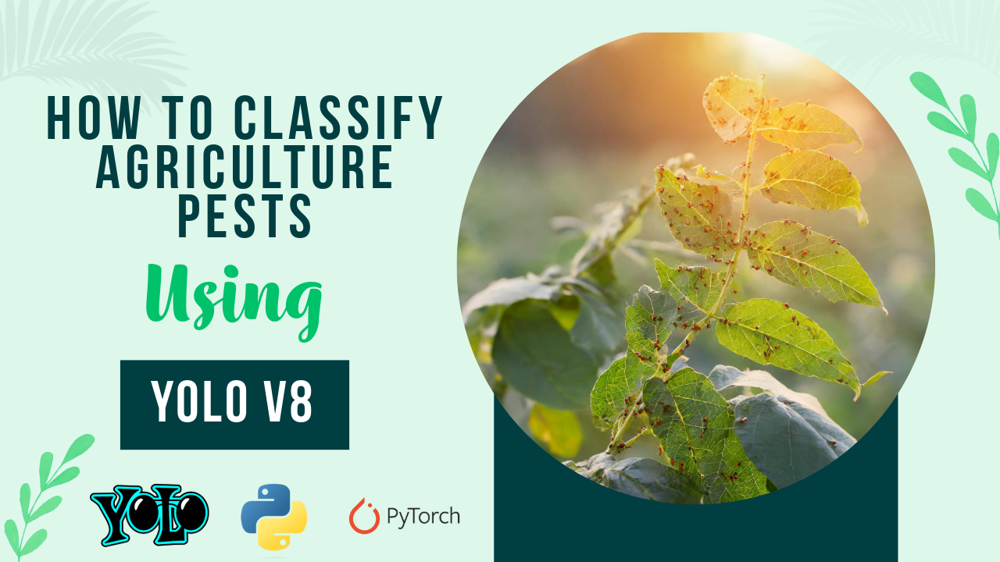

# Image Classification Using YoloV8 Model on Custom dataset | Agricultural Pests

  

##
   

In this tutorial, we dive into the world of image classification using YOLOv8 and PyTorch. 

Learn how to train YOLOv8 on a custom dataset, leveraging the power of Ultralytics' implementation on GitHub. From understanding the basics to advanced techniques, we cover everything from setting up YOLOv8 PyTorch environment to testing the model on your own images.

 

This tutorial has 4 parts : 

🔍 Download and prepare the data : We'll start by downloading the images, and preparing the dataset for the train

🐍 Create Conda enviroment and all the relevant Python libraries .

🛠️ Training : Run the train over our dataset

📊 Testing the Model: Once the model is trained, we'll show you how to test the model using a new and fresh image 

 

You can find the link for the [tutorial](https://youtu.be/--FPMF49Dpg) here. 

Full blog and code for this [tutorial](https://eranfeit.net/complete-yolov8-classification-tutorial-for-beginners/) .

You can find more cool similar projects and tutorials in this [playlist](https://www.youtube.com/playlist?list=PLdkryDe59y4aCcCN4ioFpdLVAGZ_dFeFr)

Enjoy

Eran
   

# Recommended courses and relevant products 

🚀 Want to get started with Computer Vision or take your skills to the next level ? 

If you’re just beginning, I recommend this step-by-step course designed to introduce you to the foundations of Computer Vision - [Complete Computer Vision Bootcamp With PyTorch & TensorFlow](https://trk.udemy.com/9LoE7E) 

If you’re already experienced and looking for more advanced techniques, check out this deep-dive course - [Modern Computer Vision GPT, PyTorch, Keras, OpenCV4](https://trk.udemy.com/EEDyMD)

Before we continue , I actually recommend this [book](https://amzn.to/3STWZ2N) for deep learning based on Tensorflow and Keras. 

# Connect

If you have any suggestions about papers, feel free to mail me :)

- [☕ Buy me a coffee](https://ko-fi.com/eranfeit)
- [🌐 My Website](https://eranfeit.net)
- [▶️ Youtube.com/@eranfeit](https://www.youtube.com/channel/UCTiWJJhaH6BviSWKLJUM9sg)
- [🐙 Facebookl](https://www.facebook.com/groups/3080601358933585)
- [🖥️ Email](mailto:feitgemel@gmail.com)
- [🐦 Twitter](https://twitter.com/eran_feit )
- [😸 GitHub](https://github.com/feitgemel)
- [📸 Instagram](https://www.instagram.com/eran_feit/)
- [🤝 Fiverr ](https://www.fiverr.com/s/mB3Pbb)
- [📝 Medium ](https://medium.com/@feitgemel)

